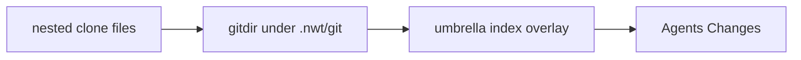
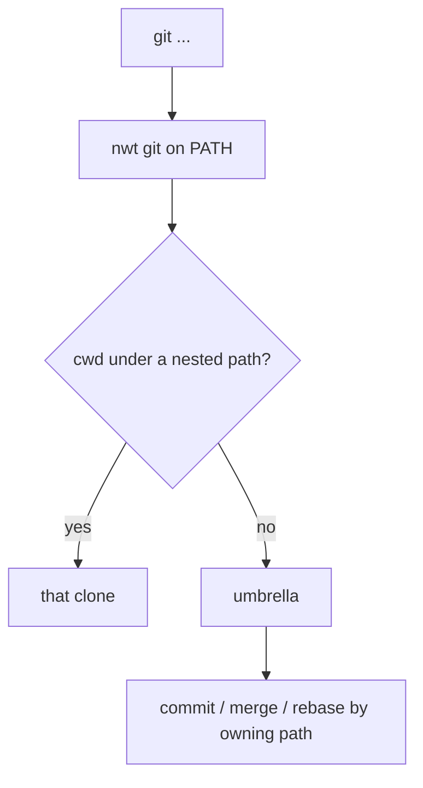
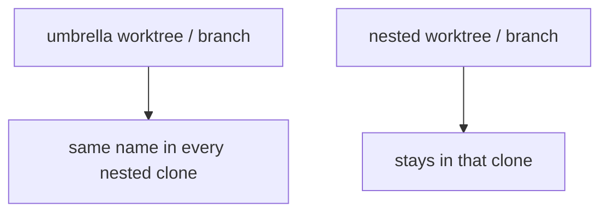
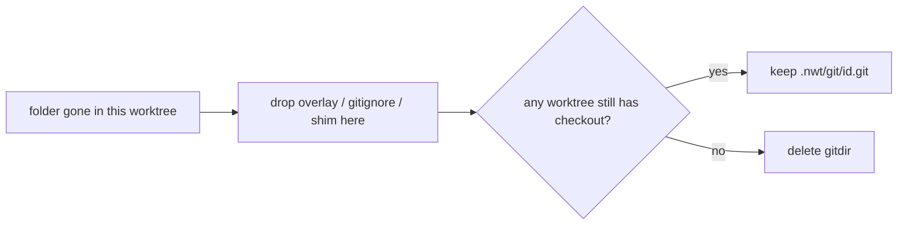

# Nested Git Worktrees (`nwt`)

Give multi-repo Cursor projects first-class git worktrees and a unified Changes view.

Install the CLI once per machine. Do **not** add `@crbn/nwt` to a host project’s dependencies.

Source: [github.com/carbonellai/nwt](https://github.com/carbonellai/nwt)

Nested clones are whatever is in `.nwt/manifest.json` (`nested[]`) — any path.



Cursor Agents Changes follows the workspace **root** git tree. nwt relocates nested gitdirs under `.nwt/git/` and **leaves nested `.git` off disk**, then snapshots nested HEAD into the umbrella index. Do not put gitfiles back in nested trees.

## Setup

```sh
npm i -g @crbn/nwt
cd /path/to/umbrella
nwt init
nwt shim-install   # ~/.local/bin/git; never /usr/bin/git
```

Hosts need Node 18+ and Git; they do not need to be Node projects.

`nwt init` discovers nested clones, relocates gitdirs, merges Cursor `hooks.json` / `worktrees.json`, pins git scan settings, vendors `.nwt/nwt.mjs` for hooks, and builds the overlay.

To initialize another directory from anywhere: `nwt install /path/to/umbrella`.

## Git shim



Install the user-level shim ahead of `/usr/bin`. Open a new terminal. `GIT_DIR` / `--git-dir` pass through. Real git is `NWT_REAL_GIT` or the first non-shim `git` on PATH.

Umbrella `commit`, `commit --amend`, `merge`, and `rebase` land in the clone that owns the files. Nested git never merges or rebases the umbrella. Overlay refresh follows.

`.nwt/bin/git` plus Cursor PATH and `sessionStart` are backups. Hardcoded `/usr/bin/git` is not intercepted.

```sh
nwt git status
nwt git -C packages/a status
nwt shim-uninstall
```

## Cascade



Root worktree/branch creation cascades **down**. Nested ops do not go up.

Cursor `/worktree` setup runs `.cursor/scripts/nwt-setup-worktree.sh`. `afterShellExecution` (`.cursor/scripts/nwt-after-shell.sh`) is a backup. Parent `.cursor/rules` copy into nested clones under `.cursor/rules/inherited/` with a `globs` prefix.

## Prune



Opportunistic: git shim, `afterShell` (any command), `sessionStart`, `nwt init` / `sync` / `prune`. `post-commit` / `post-merge` in `.nwt/hooks` backup `/usr/bin/git` only. No Husky; existing `core.hooksPath` is not overwritten.

Prune is **worktree-local** for overlay/shim/manifest. The gitdir is shared and is removed only when no umbrella worktree still has that checkout. `NWT_SKIP_PRUNE=1` during `worktree add` / `setup-worktree`.

## Commands

```sh
nwt discover
nwt init
nwt prune
nwt shim-install
nwt worktree add ../app-feature-x feature-x
nwt worktree remove ../app-feature-x
nwt branch feature-x
nwt git [-C path] status
nwt sync --commit
nwt rules apply
```
